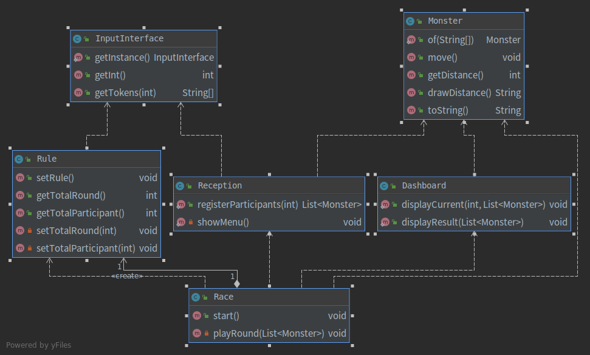

# Step 3

## 1. 설계와 디자인

#### Race 객체

- 경기 규칙을 설정하는 책임이 있다. (Rule 객체에게 위임)
- 참가자를 등록하는 책임이 있다. (Reception 객체에게 위임)
- 경기를 시작하는 책임이 있다.
- 경기 내용을 보여주는 책임이 있다. (Dashboard 객체에게 위임)

#### Rule 객체

- 경기의 규칙을 설정하는 책임이 있다.

#### Reception 객체

- 게임에 참가할 몬스터들을 생성하는 책임이 있다.

#### Monster 객체

- 움직이는 책임이 있다. (Movable 인터페이스에 위임)

#### InputInterface 객체

- 사용자로부터 유효한 입력을 얻는 책임이 있다.

#### Dashboard 객체

- 경기 내용과 결과를 출력하는 책임이 있다.

## 2. 학습정리

### 1. singleton

InputInterface 객체는 사용자로부터 유효한 입력값을 얻어오는 객체이다. 이를 위해 내부적으로
표준 입력에 접근한다. 하드웨어 리소를 사용할 때는 리소스를 사용하고 반환해주어야 한다. 하지만
매번 메서드에서 Scanner 객체를 생성하고 반환하는 작업은 오버헤드가 큰 작업이라고 생각한다. 
매번 Scanner 객체를 생성하지 않으면서 데드락을 피할 수 있는 방법은 무엇이 있을까? 싱글톤을
방식이면서 thread-safe 한 방식으로 구현하면 문제가 해결될 것 같다.

싱글톤 구현하는 방식이 3 가지 존재한다. 

1. 직접 구현(private 생성자, getInstance)
2. static 변수와 메소드로만 구성된 클래스
3. Enum 키워드

static 클래스는 컴파일 타임에 바인딩돼서 성능면에서 좋다. enum은 serialize를 지원한다.

reference
 
>https://gmlwjd9405.github.io/2018/07/06/singleton-pattern.html
>https://stackoverflow.com/questions/519520/difference-between-static-class-and-singleton-pattern  
>https://stackoverflow.com/questions/5548453/java-enum-style-singleton-vs-static-instance-getter/5548700

### 2. member variable 없는 객체는 static 메소드로 선언하는 것이 좋은가?

멤버 변수가 존재하지 않는다면 static 메소드로 작성하는 것은 합리적이다.

reference

> https://stackoverflow.com/questions/658407/should-all-methods-be-static-if-their-class-has-no-member-variables

## 3. 질문사항

1. 
2. 